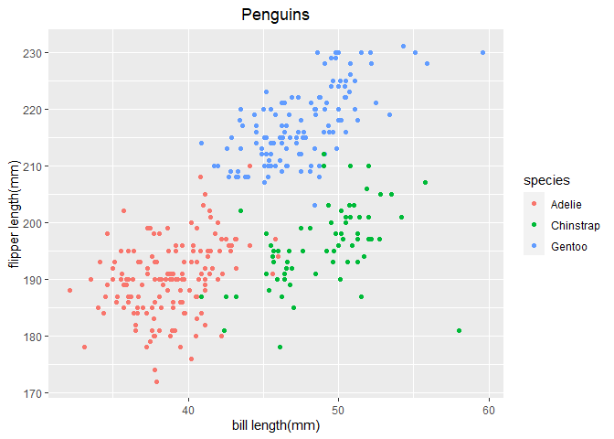

p8105\_hw1\_rw2844
================
Renjie Wei
2020/9/11

  - [Problem 1](#problem-1)
  - [Problem 2](#problem-2)

# Problem 1

The chunk below is going to create a data frame comprised of:

  - a random sample of size 10 from a standard Normal distribution
  - a logical vector indicating whether elements of the sample are
    greater than 0
  - a character vector of length 10
  - a factor vector of length 10, with 3 different factor “levels”

<!-- end list -->

``` r

df_1 = tibble(
  vec_norm = rnorm(10),
  vec_logical = vec_norm > 0,
  vec_char = rep("char", each = 10),
  vec_factor = factor(sample(c("low", "mid", "high"), 
                             size = 10, replace = TRUE))
)

df_1
## # A tibble: 10 x 4
##    vec_norm vec_logical vec_char vec_factor
##       <dbl> <lgl>       <chr>    <fct>     
##  1  -1.74   FALSE       char     mid       
##  2   2.07   TRUE        char     high      
##  3   0.978  TRUE        char     low       
##  4   1.82   TRUE        char     high      
##  5  -0.538  FALSE       char     low       
##  6  -0.0231 FALSE       char     high      
##  7   0.104  TRUE        char     high      
##  8  -1.04   FALSE       char     low       
##  9   0.196  TRUE        char     mid       
## 10  -0.601  FALSE       char     mid

#Try to apply mean() to each variable:
mean(df_1 $ vec_norm)
## [1] 0.1224699
mean(df_1 $ vec_logical)
## [1] 0.5
mean(df_1 $ vec_char)
## Warning in mean.default(df_1$vec_char): argument is not numeric or logical:
## returning NA
## [1] NA
mean(df_1 $ vec_factor)
## Warning in mean.default(df_1$vec_factor): argument is not numeric or logical:
## returning NA
## [1] NA
```

The `mean()` function works on:

  - `vec_norm`, and the average of `vec_norm` is 0.1224699
  - `vec_logical`, and the average of `vec_logical` is 0.5

But doesn’t work on:

  - `vec_char`
  - `vec_factor`

So the `mean()` function only works on *numeric* and *logical*
variables.

The chunk is going to convert *logical*, *character* and *factor*
variables to *numeric* variables.

``` r
as.numeric(df_1$vec_logical)
as.numeric(df_1$vec_char)
as.numeric(df_1$vec_factor)
```

This is the second chunk and I’m going to:

  - convert the *logical* vector to *numeric*, and multiply the random
    sample by the result
  - convert the *logical* vector to a *factor*, and multiply the random
    sample by the result
  - convert the *logical* vector to a *factor* and then convert the
    result to *numeric*, and multiply the random sample by the result

<!-- end list -->

``` r
logi_ = df_1$vec_logical
norm_ = df_1$vec_norm

as.numeric(logi_) * (norm_)
##  [1] 0.0000000 2.0659664 0.9779258 1.8227782 0.0000000 0.0000000 0.1043047
##  [8] 0.0000000 0.1956672 0.0000000
as.factor(logi_) * (norm_)
## Warning in Ops.factor(as.factor(logi_), (norm_)): '*' not meaningful for factors
##  [1] NA NA NA NA NA NA NA NA NA NA
as.numeric(as.factor(logi_)) * (norm_)
##  [1] -1.73768776  4.13193288  1.95585160  3.64555633 -0.53778296 -0.02306677
##  [7]  0.20860930 -1.04241687  0.39133431 -0.60098922
```

# Problem 2

This is a summary of the `penguins` dataset:

``` r
data("penguins", package = "palmerpenguins")
summary(penguins)
##       species          island    bill_length_mm  bill_depth_mm  
##  Adelie   :152   Biscoe   :168   Min.   :32.10   Min.   :13.10  
##  Chinstrap: 68   Dream    :124   1st Qu.:39.23   1st Qu.:15.60  
##  Gentoo   :124   Torgersen: 52   Median :44.45   Median :17.30  
##                                  Mean   :43.92   Mean   :17.15  
##                                  3rd Qu.:48.50   3rd Qu.:18.70  
##                                  Max.   :59.60   Max.   :21.50  
##                                  NA's   :2       NA's   :2      
##  flipper_length_mm  body_mass_g       sex           year     
##  Min.   :172.0     Min.   :2700   female:165   Min.   :2007  
##  1st Qu.:190.0     1st Qu.:3550   male  :168   1st Qu.:2007  
##  Median :197.0     Median :4050   NA's  : 11   Median :2008  
##  Mean   :200.9     Mean   :4202                Mean   :2008  
##  3rd Qu.:213.0     3rd Qu.:4750                3rd Qu.:2009  
##  Max.   :231.0     Max.   :6300                Max.   :2009  
##  NA's   :2         NA's   :2
```

  - The number of rows in `penguins` is 344.
  - The number of columns in `penguins` is 8.

The chunk below is going to draw a plot based on `penguins` dataset.

``` r
plot_df = tibble(
  x = penguins$bill_length_mm,
  y = penguins$flipper_length_mm
)

species = penguins$species

ggplot(plot_df, aes(x = x, y = y, color = species)) +
  geom_point() +
  xlab("bill length(mm)") +
  ylab("flipper length(mm)") +
  ggtitle("Penguins") +
  theme(plot.title = element_text(hjust = 0.5))
```

<!-- -->
